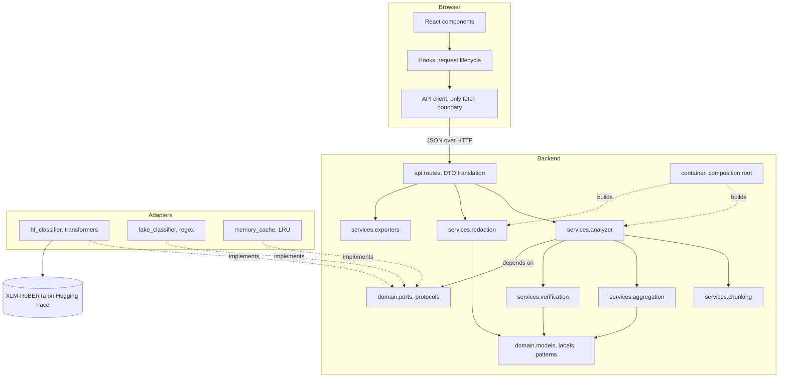
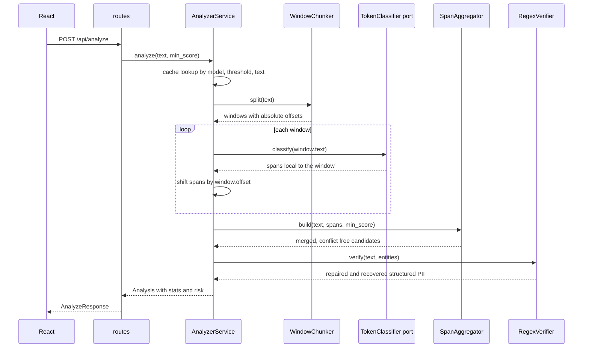

# Architecture

## Topology

The arrows into `domain.ports` are the point. Services name an interface, adapters satisfy it,
and the composition root decides which adapter exists at runtime. Nothing in `services` or
`domain` imports torch, transformers, or FastAPI.

## Request flow

## Why each layer exists

**Single responsibility.** Chunking knows windows. Aggregation knows span geometry.
Verification knows Indonesian identifier formats. Redaction knows replacement text. The
analyzer knows the order they run in and nothing about how any of them work. The original
single file mixed model loading, colour choices, span merging, HTML rendering, and server
startup in one module, which is why a boundary bug there could not be tested in isolation.

**Open for extension.** Redaction strategies and exporters live in registries keyed by name.
A new strategy is a class plus one entry, never an edit to `RedactionService`. The API exposes
the registry through `/api/meta`, so the React dropdown grows without a frontend change.

**Liskov.** `FakeClassifier` and `HuggingFaceClassifier` both return absolute character offsets
and the same span shape, so the analyzer cannot tell them apart. The test suite runs the whole
pipeline through a third implementation, `MarkerClassifier`, for exact expected offsets.

**Interface segregation.** Ports are one or two methods. A cache implements get and put and
knows nothing about entities. `Verifier` sees text and entities and nothing about models.

**Dependency inversion.** `container.py` is the only module aware of every concrete class.
Swapping in an ONNX or remote inference backend means one new adapter and one line there.

## Correctness notes

**Offsets.** Every span is stored as an absolute character range into the submitted text, and
tests assert `text[start:end] == entity.text` including for entities that appear only in a
later window. Window boundaries snap backwards to sentence or whitespace boundaries so a cut
never lands inside a word.

**BIO aware merging.** Merging is driven by the tag prefix. An `I-` span continues the span
before it when only whitespace separates them, a `B-` span always starts a new entity. This is
what keeps two adjacent people separate, and it is covered by
`test_separate_people_are_not_glued_together`.

**Overlap dedupe.** Windows overlap by design, so the same entity can be reported twice. Spans
of one type that overlap are unioned and keep the best score. Spans of different types that
overlap are resolved in favour of the higher score, which guarantees the non overlapping
sequence the renderer assumes.

**Cache key.** The key covers the model id, the threshold, and the text, so changing the
threshold or the backend cannot serve a stale result.

## Extension points

| Goal | Change |
|---|---|
| New inference backend | Add an adapter implementing `TokenClassifier`, register it in `build_classifier` |
| New redaction mode | Add a strategy class, add one line to `STRATEGIES` |
| New export format | Add a function, add one line to `EXPORTERS` and `MEDIA_TYPES` |
| New entity type | Add a `LabelSpec` to `LABELS`, the UI colours and legend follow automatically |
| New identifier format | Add a pattern to `domain/patterns.py`, verification picks it up |
