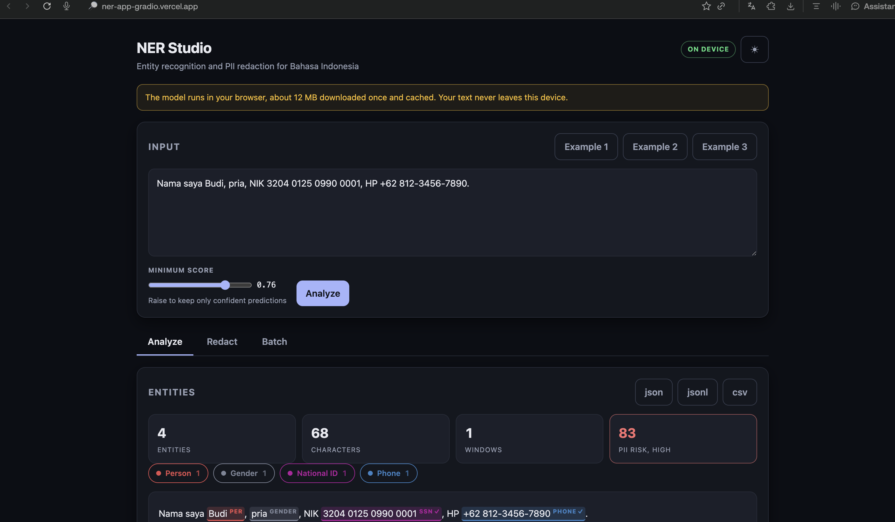

# NER Studio, Bahasa Indonesia

Named entity recognition and PII redaction for Indonesian text that **runs entirely in your
browser**. The model is 11.7 MB, downloaded once and cached, so your text never leaves your
device and there is no server to pay for.

Model: [0xcynyx/ner-pii-indonesian-mini](https://huggingface.co/0xcynyx/ner-pii-indonesian-mini),
distilled from a 2,235 MB teacher down to 11.7 MB, **191 times smaller** at 99.5 percent of its
F1. Seven types: person, location, date or time, email, phone, gender, and Indonesian NIK.

An optional FastAPI backend is included for server side or batch use, but nothing in the web app
requires it.

[](https://ner-app-gradio.vercel.app)

Live: [ner-app-gradio.vercel.app](https://ner-app-gradio.vercel.app). The ✓ marks on the
national ID and phone number mean an exact format check confirmed them, and `pria` was split
out of the person span into its own gender entity.

## Deploy the web app

It is a static bundle, 56 KB gzipped, so any static host works and none of them need a plan.

**Vercel**

1. Import this repository at [vercel.com/new](https://vercel.com/new).
2. Set **Root Directory** to `frontend`. Everything else is already declared in
   `frontend/vercel.json`.
3. Deploy. No environment variables are needed, browser inference is the default.

To point the app at a server backend instead, set `VITE_API_BASE` to its URL and a
run-in-browser or run-on-server switch appears in the header.

**Any other static host**

```bash
cd frontend && npm install && npm run build   # writes dist/
```

Upload `dist/`. This also works on a free Hugging Face Static Space, which is the only Space
tier that stays free now that Gradio and Docker Spaces require a paid plan.

## How the browser path works

No inference server, and no heavy client libraries either.

| Piece | Choice | Why |
|---|---|---|
| Tokenizer | 130 line WordPiece in `src/engine/wordpiece.ts` | transformers.js would add about 900 KB just to tokenize, and it does not support this architecture for token classification |
| Runtime | onnxruntime-web loaded from a CDN | bundling it pulls in 44 MB of WASM variants |
| Post processing | TypeScript port of the backend services | a static deployment has no server to call |

The tokenizer is verified to emit identical ids to the Python tokenizer, so the browser path is
not an approximation of the server path. Confirmed running on device in the screenshot above.

## What it does beyond the original demo

| Capability | Why it matters |
|---|---|
| Long document support | The model caps at 512 tokens. Text is split into overlapping windows and offsets are mapped back, so a full page is analysed instead of silently cut. |
| Rule assisted structured PII | Email, phone, and national ID have no continuation label in the model, so they arrive fragmented. Regex repairs the boundaries and recovers missed values, then marks them verified. |
| Five redaction strategies | Mask, label, pseudonym, partial, and remove. Pseudonym is stable per value, so the same person stays linkable across a corpus without exposing the name. |
| Sensitivity scoped redaction | Redact only what crosses a sensitivity level, for example national ID alone. |
| PII risk score | A 0 to 100 score from the most sensitive type present plus a capped volume term. |
| Confidence control | A live minimum score threshold, with per entity scores in the table and tooltips. |
| Batch and file input | Many documents at once, or upload a txt file as one document per line or a csv with a text column. |
| Exports | JSON, JSONL, and CSV downloads. |
| Correct entity boundaries | Adjacent same type entities no longer fuse, so "Joko dan Prabowo" stays two people, while subword fragments of one name rejoin. |
| Regex outranks the model on exact formats | The uncased model reads `siti.rahma@contoh.co.id` as a person. An exact email match is stronger evidence, so it wins. |
| Demo backend | A rule based classifier satisfies the same interface, so the UI and the full test suite run with no model download. |

## Run with Docker

```bash
docker compose up --build
```

Open http://localhost:7860. The first start downloads the model, roughly 2.2 GB.

To try the interface with no model download:

```bash
NER_BACKEND=fake docker compose up --build
```

## Run locally

```bash
make install
make dev      # API on 8000 with the rule based backend
make web      # React dev server on 5173, proxies /api
```

For the real model, install the extra requirements and use the model backend:

```bash
backend/.venv/bin/pip install -r backend/requirements-model.txt
make api
```

## Configuration

Everything is environment driven, nothing operational is hardcoded.

| Variable | Default | Purpose |
|---|---|---|
| NER_BACKEND | huggingface | `huggingface` or `fake` |
| NER_MODEL_ID | 0xcynyx/ner-roberta-large-bahasa-indonesia-finetuned | Model to load |
| NER_MODEL_REVISION | empty | Pin a specific commit |
| NER_MIN_SCORE | 0.5 | Default confidence floor |
| NER_WINDOW_CHARS | 1200 | Window size for long text |
| NER_OVERLAP_CHARS | 200 | Overlap between windows |
| NER_MAX_CHARACTERS | 50000 | Hard input cap per document |
| NER_MAX_BATCH | 50 | Documents per batch request |
| NER_CACHE_SIZE | 128 | Result cache entries, 0 disables |
| NER_PSEUDONYM_SALT | empty | Salt for the pseudonym strategy |
| NER_WARMUP | false | Load the model at startup |
| NER_CORS_ORIGINS | * | Comma separated origins |
| NER_FRONTEND_DIR | static | Built bundle to serve |

## API

Interactive docs at `/docs`.

| Method | Path | Purpose |
|---|---|---|
| GET | /api/health | Liveness and active backend |
| GET | /api/meta | Labels, strategies, formats, limits |
| POST | /api/analyze | Entities, stats, and risk for one document |
| POST | /api/redact | Rewritten text plus the entities behind it |
| POST | /api/batch | Many documents in one call |
| POST | /api/upload | txt or csv file, returns a batch result |
| POST | /api/export | Download entities as json, jsonl, or csv |

```bash
curl -X POST http://localhost:7860/api/redact \
  -H 'Content-Type: application/json' \
  -d '{"text":"Budi, NIK 3204 0125 0990 0001, HP 081234567890","strategy":"label"}'
```

## Architecture

Layers depend inward only, so the model library sits behind an interface and never leaks into
the services. See [ARCHITECTURE.md](ARCHITECTURE.md) for the diagrams and the reasoning.

```
frontend/           React and TypeScript, API client isolated from components
backend/app/domain  value objects, label taxonomy, PII patterns, ports
backend/app/services chunking, aggregation, verification, redaction, analysis, exporters
backend/app/adapters transformers classifier, rule based classifier, cache
backend/app/api     routes and DTOs
backend/app/container composition root, the only module that knows every concrete class
```

## Tests

```bash
make test
```

57 backend tests cover chunking, BIO aggregation, regex verification, every redaction strategy,
cross window offset mapping, caching, and all endpoints. They run without torch because the
classifier is injected.

## Making the model smaller

`tools/compress` holds the pipeline that produced the 11.7 MB model, and it is reusable for any
Hugging Face token classifier.

| Stage | Size | F1 | ms/doc CPU |
|---|---|---|---|
| Original teacher | 2,235 MB | 0.9098 | 48.8 |
| Vocabulary trimmed, INT8 | 337 MB | 0.8883 | 18.6 |
| Distilled student, INT8 | **11.7 MB** | 0.9049 | **12.1** |

Vocabulary trimming alone removed 40 percent of the parameters with identical output, because
nearly half of XLM-R large is an embedding table for 100 languages. See
[tools/compress/README.md](tools/compress/README.md) for the method and the traps, including the
ALBERT weight sharing issue that inflated the first quantized build from 11.7 MB to 41 MB.

## Limitations

- Scores come from the model and are not calibrated probabilities.
- Gender detection is a lexical signal, treat it as a hint.
- The pseudonym mapping re identifies people, so return it only in trusted contexts.
- Redaction reduces risk, it is not a compliance guarantee. Review sensitive output.

## License

MIT
